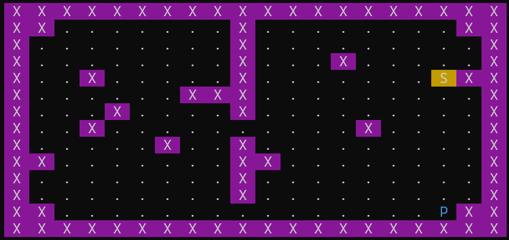
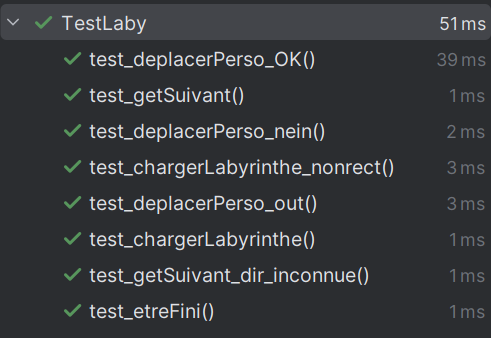
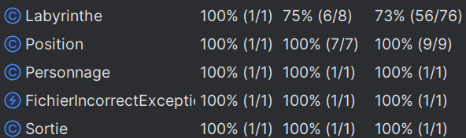

# Projet Labyrinthe Ricochet

### Auteurs 
[Rémi Choffat](https://github.com/remi-choffat) et [Mathieu Graff](https://github.com/Cesareuh)  

<p></p>
  
### Lancement de l'application
Pour lancer l'application, il faut :  
 - Compiler le programme avec la commande ```javac MainLaby.java```
 - Exécuter le programme avec ```java MainLaby [fichier_carte_jeu.txt]```  
  
### Conception et programmation
#### Difficultés rencontrées
Nous n'avons pas rencontré de difficultés particulières lors de ce TP. Les tests unitaires nous ont permis de nous rendre compte de certaines subtilités dans le fonctionnement de nos méthodes, que nous avons vite corrigées.

#### Choix de programmation
Nous avons décidé d'aller plus loin que ce qui était attendu, en essayant d'améliorer l'expérience utilisateur. Nous avons amélioré l'aspect graphique (espacements et éléments colorés, afin de rendre le jeu plus lisible et agréable). Nous avons également fait en sorte de ne pas faire survenir d'erreur, mais plutôt des avertissements qui demandent à l'utilisateur de saisir les informations erronées.

#### Résultats des tests
Nous avons réalisé nos tests en nous basant, pour la plupart, sur les fichiers labyrinthe fournis. Tous nos tests sont validés.
<p></p>

#### Couverture de test

Nos tests ont été réalisés dans le but de couvrir l'intégralité des cas possibles.
Nous testons :  
 - La méthode ```etreFini()```
 - La méthode ```getSuivant()``` avec une direction valide, puis avec une direction invalide
 - La méthode ```deplacerPerso()``` lors d'un déplacement normal, d'un déplacement contre un mur, et d'un déplacement en dehors des limites du labyrinthe
 - La méthode ```chargerLabyrinthe()``` lors d'un chargement normal, et d'un chargement avec un fichier incorrect
<p></p>

